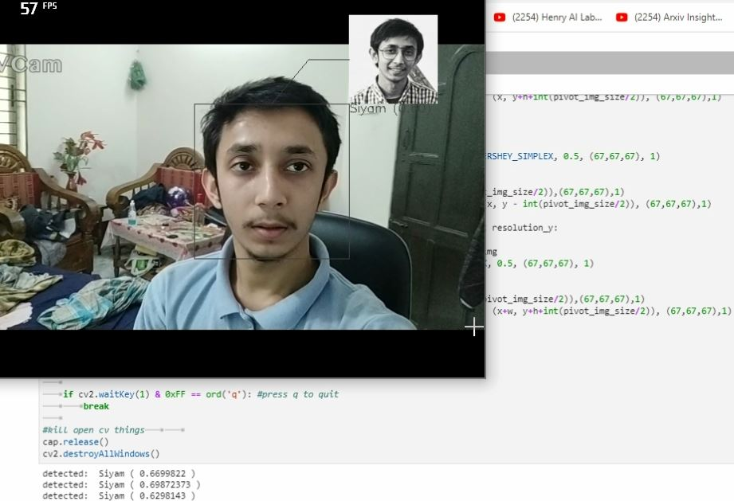
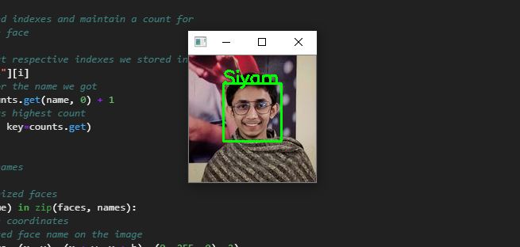

I've used two methods for face recoginition.

The first one is:

location embedding based face recognition project. Accuracy of this model is very high, so the computational cost is also high.

The second one is:

using face-recognition library. It is pretty accurate and perform well in low ended devises. It is considered as industrial standard for face recognition.

